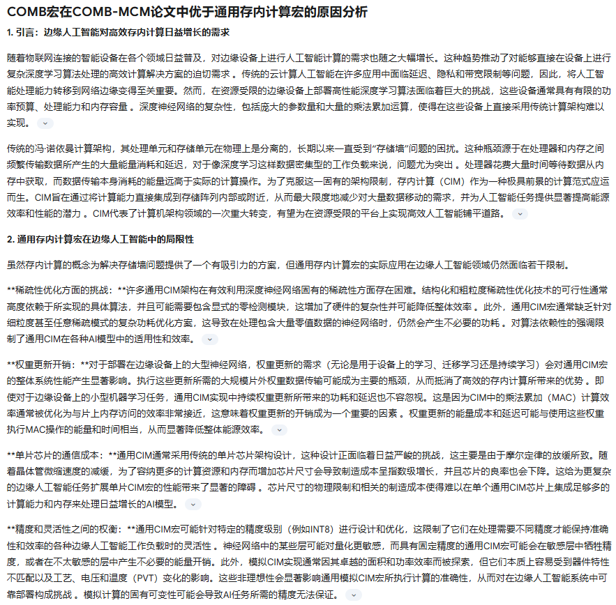
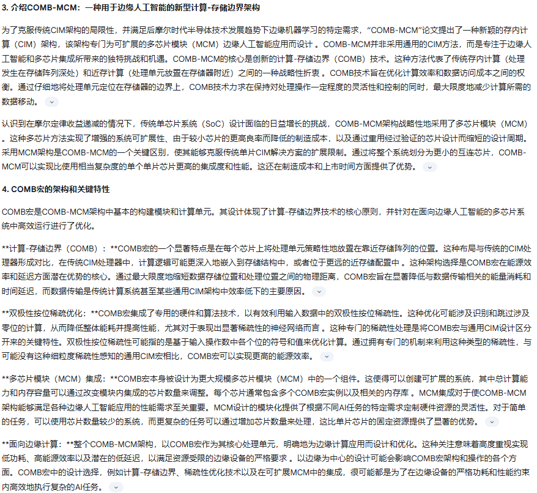
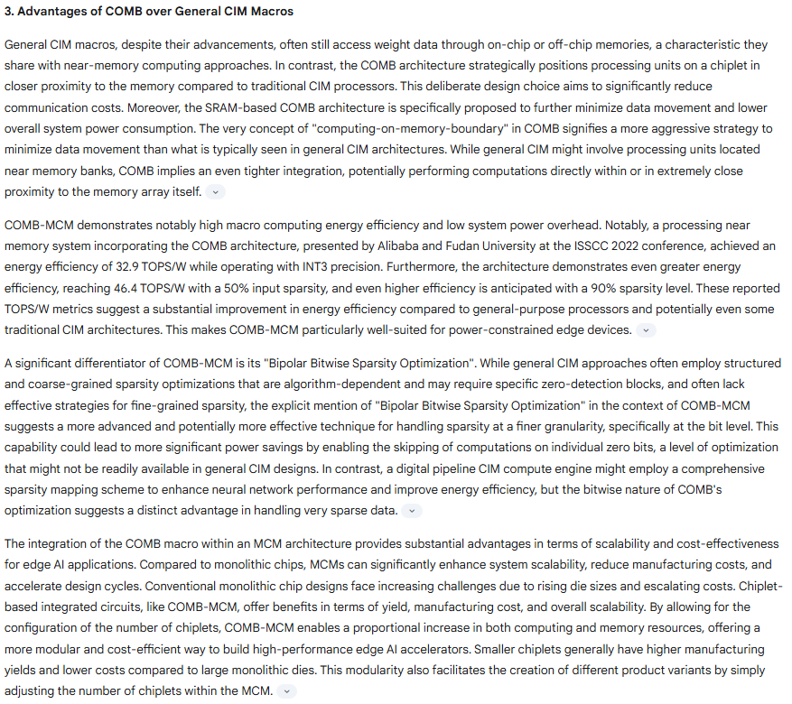
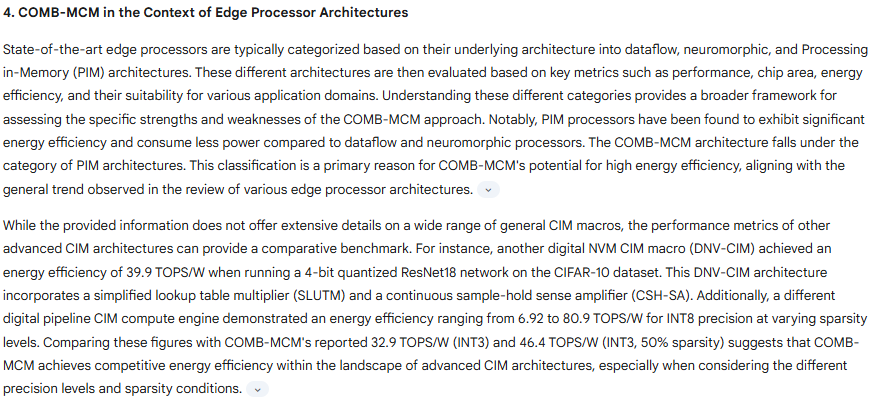
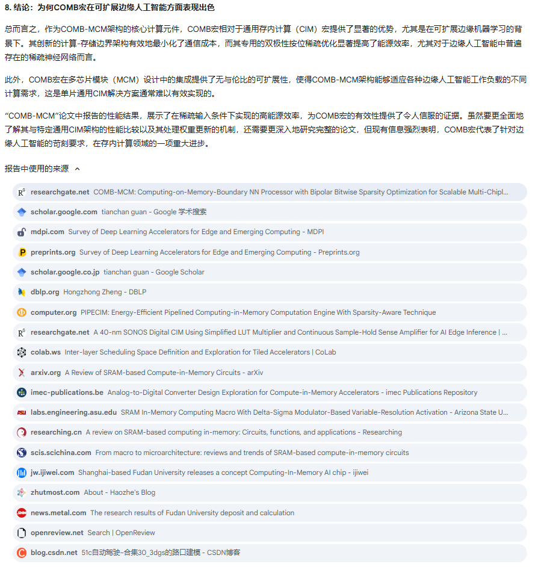

# An-Analysis-of-the-COMB-Macro
Here, we analyzed the reasons why the COMB macro in the COMB-MCM paper is better than general Compute-in-Memory macros using Google Gemini. The results are divided into five screenshot pictures.

